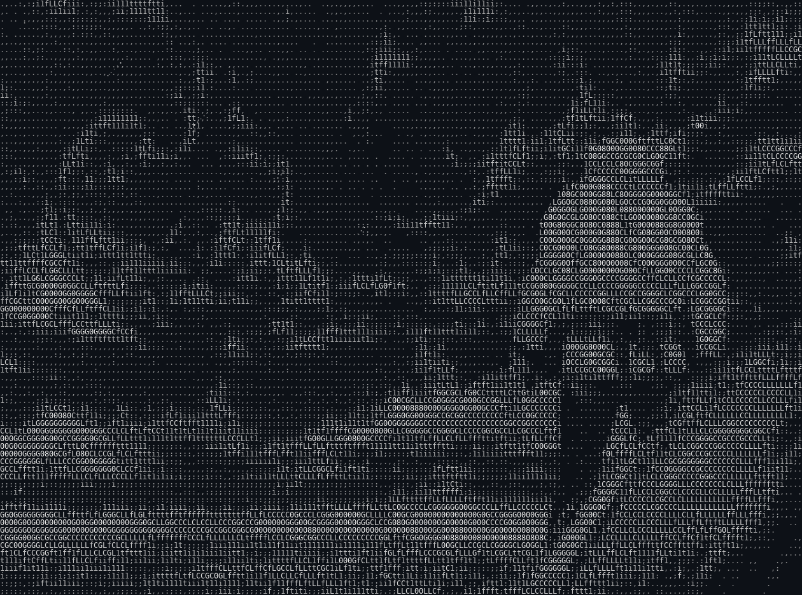
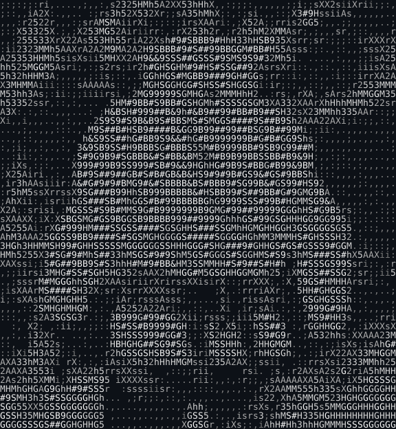
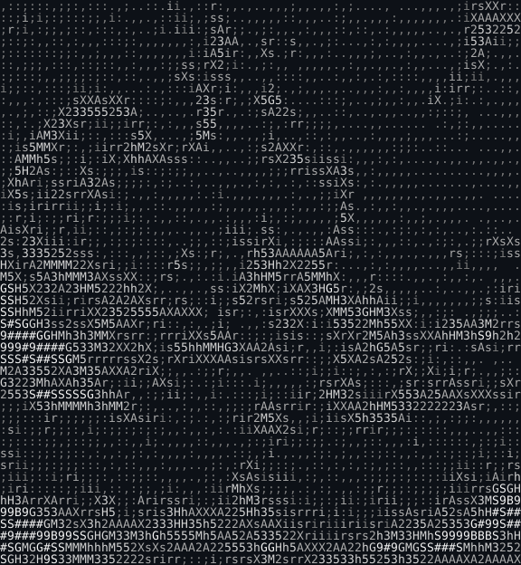
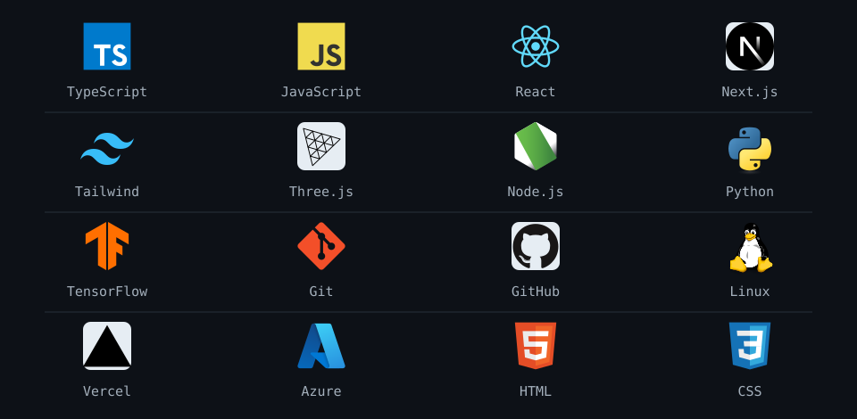
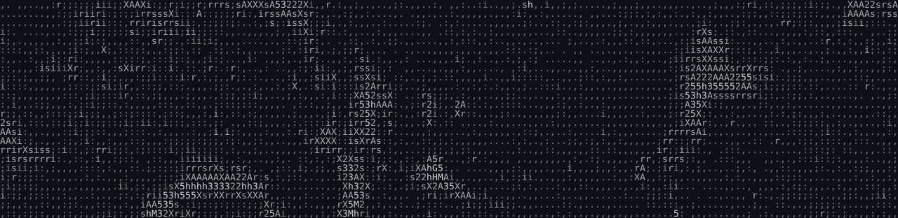

<picture>
<source media="(max-width: 600px) and (prefers-reduced-motion: reduce)" srcset="assets/black-ice/panel-mobile.png" />
<source media="(prefers-reduced-motion: reduce)" srcset="assets/black-ice/panel.png" />
<source media="(max-width: 600px)" srcset="assets/black-ice/panel-mobile.png" />

</picture>

<table><tr>
<td width="50%"></td>
<td width="50%"></td>
</tr></table>

<picture>
<source media="(max-width: 600px)" srcset="assets/black-ice/tools-matrix-mobile.svg" />

</picture>

<table align="center"><tr>
<td align="center" width="50%"></td>
<td align="center" width="50%"></td>
</tr></table>

ASCII adaptation of artwork from <a href="https://www.viz.com/manga-books/manga/climber/all">The Climber</a> · Shin-ichi Sakamoto. Original artwork belongs to its respective rights holders.
