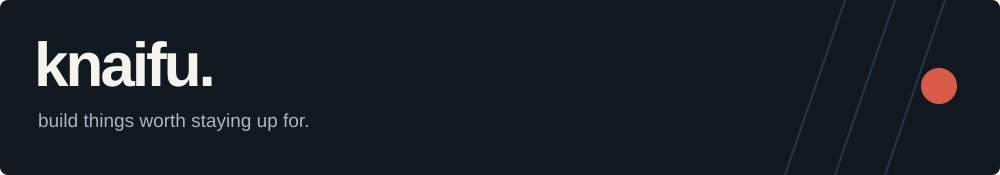
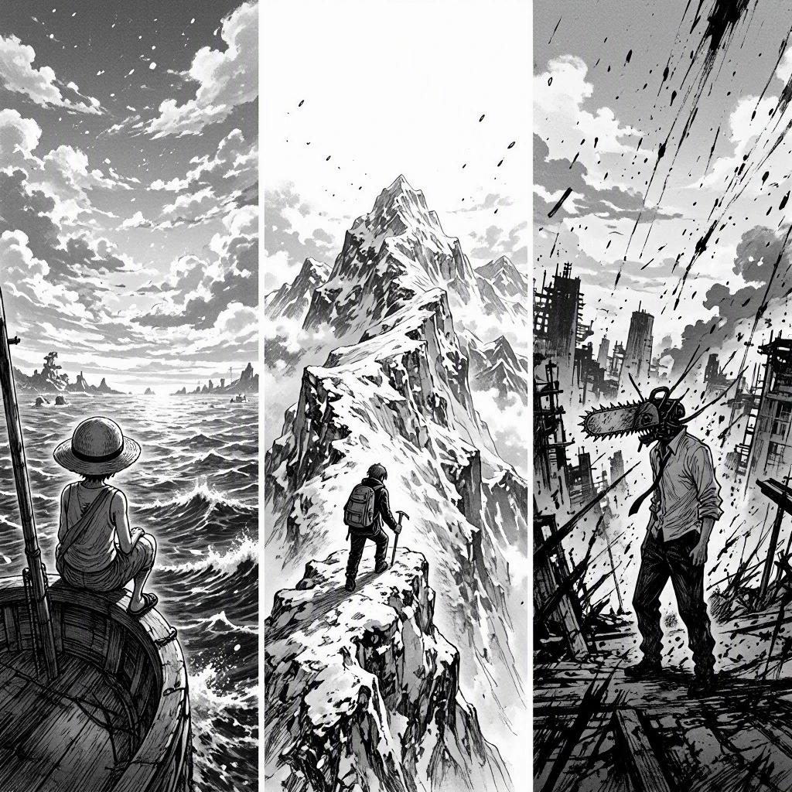

<table>
<tr>
<td width="56%" valign="top">

### About me

I'm **Knaifu**. I build web experiences, developer tools and experiments that turn into projects.

I run [**Asyra**](https://asyra.in), where design and engineering meet. Outside that: manga, games, and ideas that probably deserve their own repository.

```ts
const knaifu = {
  building: ["web", "automation", "AI tools"],
  sideQuests: ["simulations", "games"],
  reading: [
    "One Piece",
    "The Climber",
    "Chainsaw Man"
  ]
};
```

[Explore my work](https://github.com/Knaifu0030?tab=repositories) · [Asyra](https://asyra.in)

</td>
<td width="44%" valign="top">

<sub>Freedom. Persistence. A little chaos.</sub>
</td>
</tr>
</table>

## Tech stack

**Frontend & UI**


**Backend & experiments**


**Tools & delivery**


## Selected work

| Project | What I'm exploring |
| :--- | :--- |
| [**THRU**](https://github.com/Knaifu0030/thru) | Website workflows exposed through a UI, REST, CLI and MCP. |
| [**Webcmd**](https://github.com/Knaifu0030/webcmd) | Browser tooling for reusable web workflows. |
| [**Fruitfly Simulation**](https://github.com/Knaifu0030/fruitfly-simulation) | Connectome data, visualization and virtual-world experiments—not a brain emulation. |
| [**Cmdee**](https://github.com/Knaifu0030/cmdee) | A conversational terminal with a little personality. |

---

<sub>Manga corner: One Piece — Eiichiro Oda · The Climber — Shin-ichi Sakamoto / Yoshirō Nabeda, based on Jirō Nitta's novel · Chainsaw Man — Tatsuki Fujimoto. Banner illustration is an original AI-generated tribute, not published manga panels.</sub>
