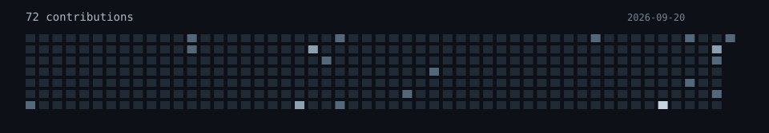

<picture>
  <source media="(prefers-reduced-motion: reduce)" srcset="assets/summit-static.svg" />
  
</picture>

<picture>
  <source media="(max-width: 600px)" srcset="assets/tools-matrix-mobile.svg" />
  
</picture>

<table align="center"><tr>
<td align="center" width="50%"></td>
<td align="center" width="50%"></td>
</tr></table>
